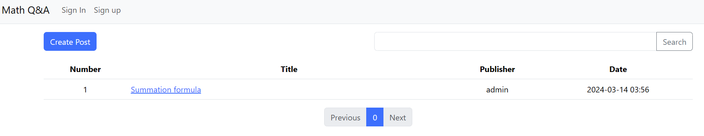
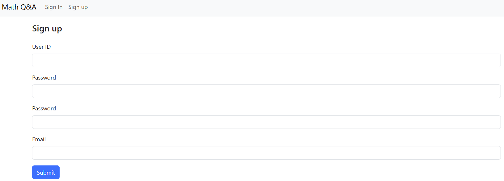
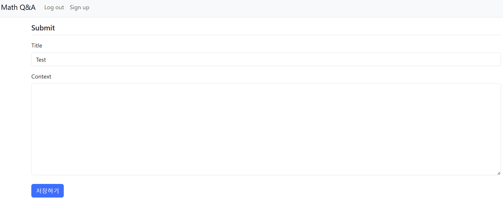
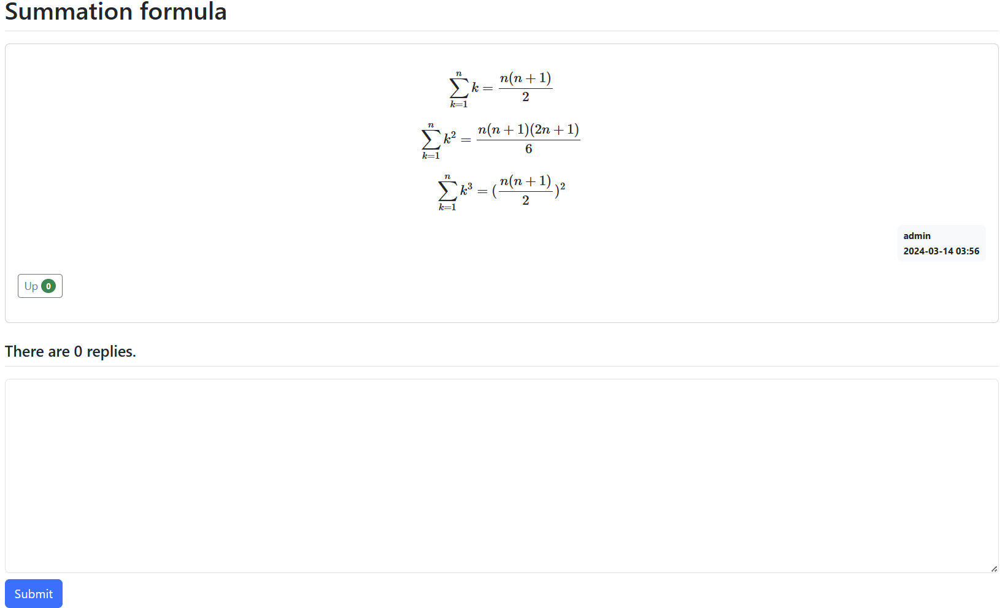

# Math Q&A website
- This is a 5 page CRUD website with login functionality. I used Spring boot and PostgreSQL.

## Pages
1. Main page

2. Sign up page

3. Sign in page

4. Add post page

5. View post page

## Database
All the data are saved in the database in CloudType.

## Server hosting

- The website is currently hosted on CloudType, but the server turns off itself automatically, so in order to view the program, I need to manually turn on the server.